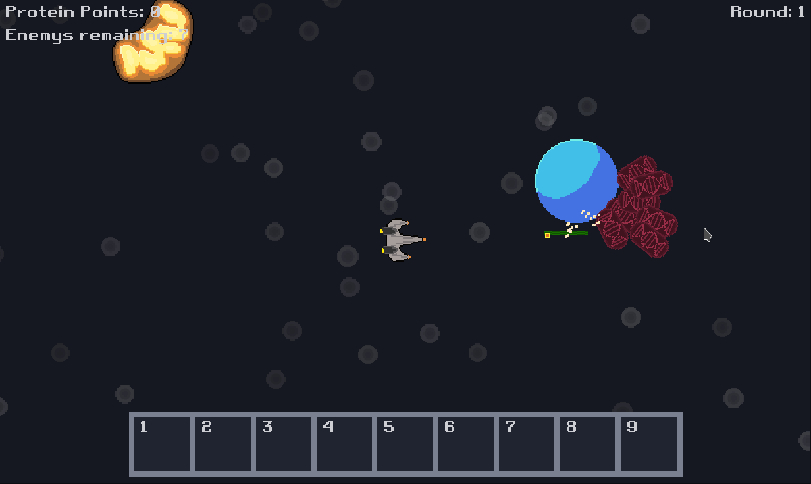

# Cell Defence

You are a nanobot tasked with defending the nucleus from the virus. How many rounds can you withstand the attack?

This game was made in 48 hours for ludum dare 46, check it out:

- [Ludum Dare](https://ldjam.com/events/ludum-dare/46/cell-defence)
- [Itch.io](https://mrbenshef.itch.io/cell-defence)